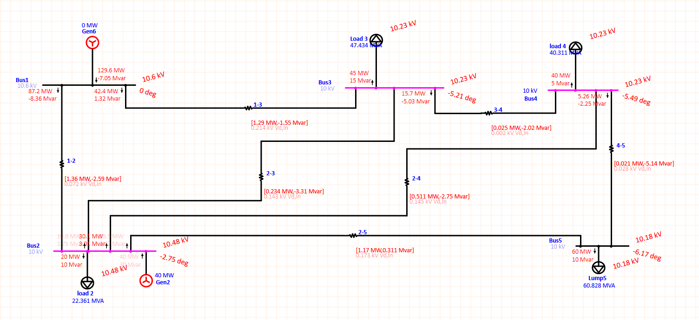
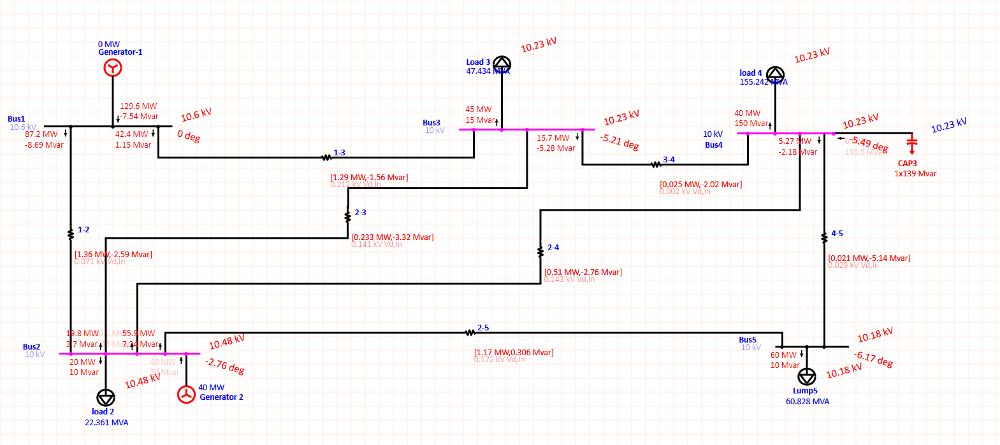

## loadflow-etap

## Project Description
The simulation involves critical tasks such as identifying and addressing undervoltage conditions, using shunt capacitors for voltage support, and controlling power flow through transformers. Additionally, the system’s behavior under fault conditions, including unsymmetrical faults like line-to-ground (L-G) and line-to-line (L-L), is analyzed. By using ETAP for real-time simulation and MATLAB for verification through the Gauss-Seidel method, the project offers a comprehensive approach to understanding and optimizing the performance of power systems under various operational scenarios.

## Project Details
- **Technology Stack**: Etap, Matlab
- **Version**: 1.0.0
- **License**: MIT License
- **Author**: [Pretom Das](https://github.com/pretom-das)

## Features
- Feature 1: Conduct Load Flow Analysis .
- Feature 2: Mitigate Undervoltage.
- Feature 3: Control Power Flow.
- Feature 3: Perform Fault Analysis.

## Screenshots
Here are some screenshots of the project:


*Screenshot 1 Etap Simulation*


*Screenshot 2 Solving Unvervoltage using Capacitor Bank*


*Screenshot 1 Fault Analysis*

## Installation
1. Clone the repository:  
   ```bash
   git clone https://github.com/pretom-das/loadflow-etap/
